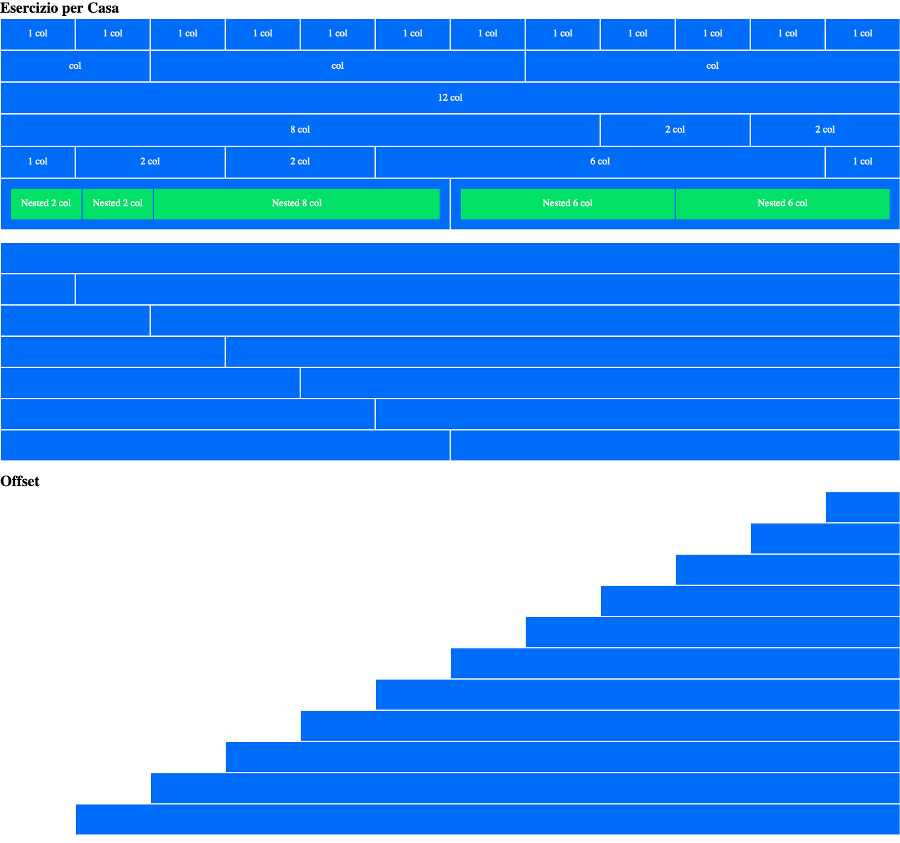
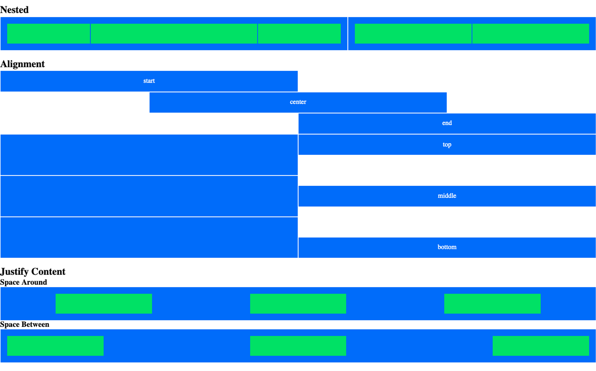

# 12 Bool

> Esercizio 12 Bool

## Creiamo il nostro framework a 12 colonne nel file 12bool.css

- Descrizione

  Usiamolo per riprodurre lo screenshot in allegato.
  Le regole che non sono parte del framework andranno inserite nel nostro solito style.css.
  Ricordiamoci sempre di inserire prima il link al nostro framework e poi quello allo style specifico della pagina.
  Finito di riprodurre lo screenshot allegato, provate a impadronirvi del vostro micro-framework giocandoci un po'. Come quando suonate uno strumento, la fase di creazione viene sempre quando dimenticate che lo strumento non sia parte del vostro corpo e lo usate per esprimervi come usereste la vostra voce.

* Consigli

  - Vi chiediamo solo di usare una cartella - bonus - per inserire i vostri lavori.
    Per il resto lasciate pure libera la vostra fantasia e stupiteci.
    Imparare HTML e CSS è anche creare cose belle.

* Bonus

  - Utilizzare 12 bool in modo creativo in stile pixel art.
    In questo zip ci sono degli esempi svolti da ex studenti che possiamo lasciare per ispirazione

  - Se qualcuno finito il - BONUS I - dovesse chiedervi dell'altro:
    
